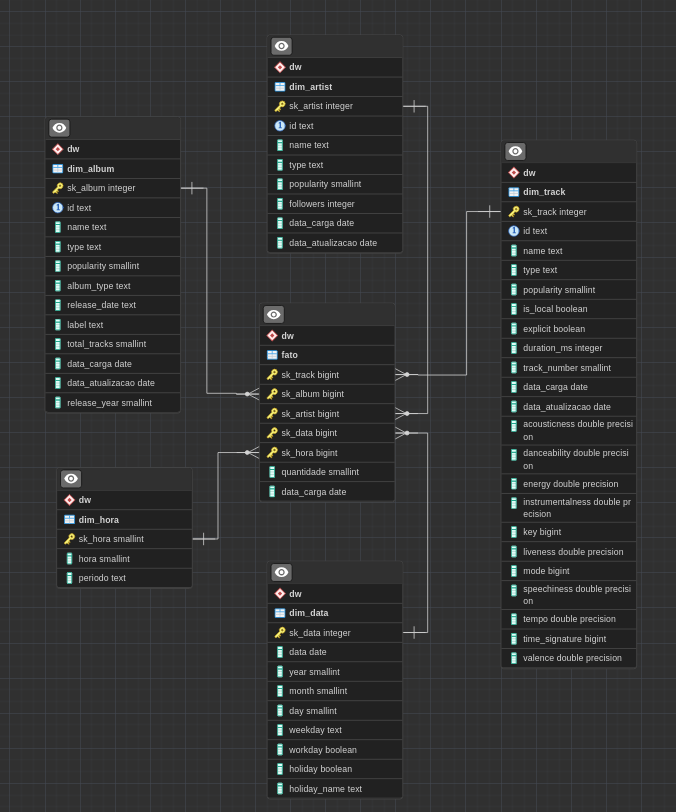

# 🌕 Mercury 

### Projeto de ETL utilizando a API do Spotify
Projeto desenvolvido para praticar aprendizados do curso **Design e Modelagem de Data Warehouses** da Data Science Academy.

## Descrição do Projeto:
O Mercury tem como objetivo obter insigths através dos dados disponibilizados pela API do Spotify. Inicialmente a proposta é obter o máximo de informação possível associada às músicas escutas diariamente por um usuário, e obter seus próprios insigths.

## Tecnologias e Ferramentas utilizadas:

- ETL: [Python](https://www.python.org/) [(Pandas)](https://pandas.pydata.org/)
- Data Visualization: [Metabase](https://www.metabase.com/)
- Banco de dados: [PostgreSQL](https://www.postgresql.org/)
- Infraestrutura: [Docker](https://www.docker.com/)

## ETL:
1. Extração de dados em lotes consumindo a API do Spotify, obtendo dados referentes às ultimas músicas escutadas em determinado período, a partir desse retorno são obtidos os ids de: track, album, artista e o timestamp da escuta.
2. A partir dos ids, são filtrados apenas os ids únicos, para reduzir chamadas aos endpoints na etapa 4.
3. Dependendo do volume de dados, é necessário separar em lotes, pois a API possui limitações de ids por chamada.
4. Com os ids únicos, realizam-se consultas nos respectivos endpoints para obter os dados relacionados aos artistas, tracks e album.
5. Os dados iniciais da primeira extração correspondem a tabela fato, as consultas derivadas da etapa anterior correspondem a dimensões, todos os dataframes são gravados na stage para tratamento.
6. Dentro da stage, são executadas stored procedures que tratam os dados, lidam com inconsistências da fonte e padronizam para serem gravados (upsert) dentro do Data Warehouse.
7. Após o processo os dados se encontram limpos, organizados e estruturados no Data Warehouse disponível para utilização no Metabase

## Modelagem de dados:

- O projeto segue o modelo star schema, com granularidade por hora, com uma tabela fato centralizada e diversas dimensões relacionadas aos fatos. Essa modelagem de dados permite consultas eficientes e análises detalhadas sobre as músicas escutadas ao longo do tempo. O star schema e a granularidade por hora ajudam a otimizar as consultas e facilitam a exploração dos dados no Metabase ou outras ferramentas de análise. 

  

